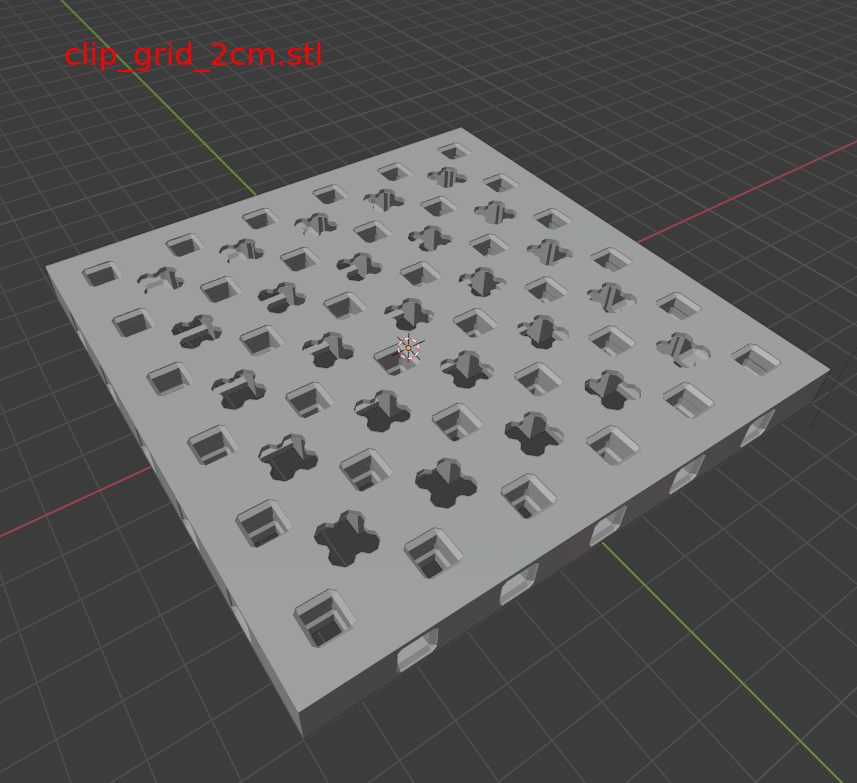

# MakerGrid - A 3D Printed grid system for makers

This system allows you to temporarily setup electronics or other
devices on an extensible modular base platform.

The primary base platform
is 12x12cm big, 1cm high and has a 2x2cm grid for clipping in all sorts of stuff,
such as:

- Bread boards
- Electronics modules such as:
  - Arduino Uno / Nano
  - Raspberry Pi 4
  - Raspberry Pi Pico

The system is extensible as with the generic clip design you can make
your own models to clip into the board. A clip looks like this:

It's not rotateable, but it fits well into the holes and provides good
stability.

## Recommended Printer Settings

Basically you can print it in any way you like, but I recommend
following settings for printing:

- 0.4mm nozzle
- 0.3mm layer height

## License

3D MakerGrid is licensed under the
Creative Commons - Attribution - Share Alike
license.
