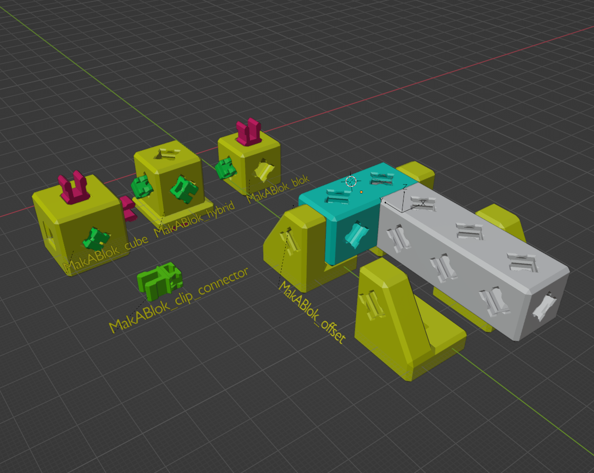

# MakerGrid Blender and STL Files

Here are the Blender files that are used to generate the
STL files that you can find here. Here is an STL index:

## Basic MakerGrid Parts

## Utilities

You can find more stuff in the subdirectories:

- `cases` assorted cases and holders for electronics.
- `utils` all kinds of useful stuff to plug onto your MakerGrid.
- `devices` specific devices made for the MakerGrid.

## Miscellaneous 

- `clip-mini_clip_holder.stl` is a base holder you can drop into new designs
for small cases. It's like a small version of the bigger clip, but directed
directly towards case design.
    - `clip-mini_clip.stl` the corresponding clip.

## PrintABlok Compatibility Models

In the `mak_a_blok.blend` file you find the following adapter files
that make it possible to combine parts of the MakerGrid and PrintABlok system.

See also the STL files:

- [PrintABlok MakerGrid Clip Connector](mak_a_blok-MakABlok_clip_connector.stl)
- [PrintABlok block with MakerGrid hole](mak_a_blok-MakABlok_blok.stl)
- [PrintABlok block with MakerGrid wide base hole](mak_a_blok-MakABlok_hybrid.stl)
- [MakerGrid cube with PrintABlok holes](mak_a_blok-MakABlok_cube.stl)

## License

3D MakerGrid by Weird Constructor is licensed under the
Creative Commons - Attribution - Share Alike license.
