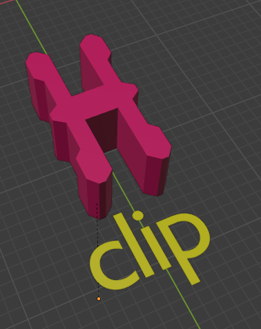
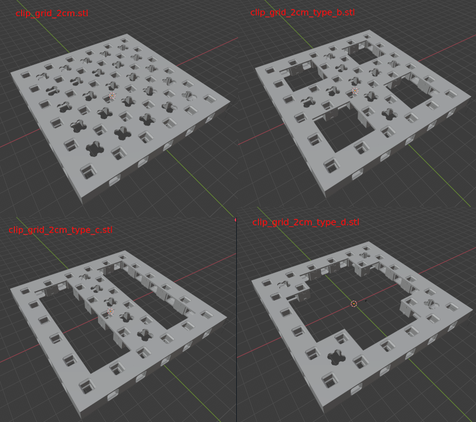

# MakerGrid Blender and STL Files

Here are the Blender files that are used to generate the
STL files that you can find here. Here is an STL index:

## Basic MakerGrid Parts

## Utilities

You can find more stuff in the subdirectories:

- `cases` assorted cases and holders for electronics.
- `utils` all kinds of useful stuff to plug onto your MakerGrid.

## Miscellaneous 

- `clip-mini_clip_holder.stl` is a base holder you can drop into new designs
for small cases. It's like a small version of the bigger clip, but directed
directly towards case design.
    - `clip-mini_clip.stl` the corresponding clip.

## License

3D MakerGrid by Weird Constructor is licensed under the
Creative Commons - Attribution - Share Alike license.
