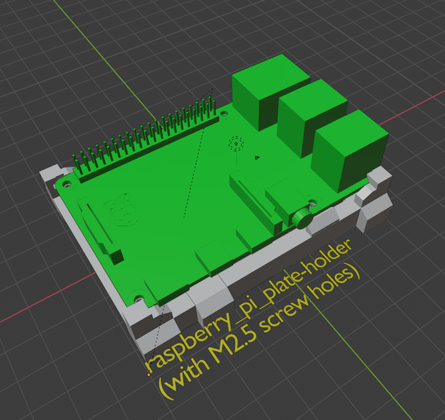
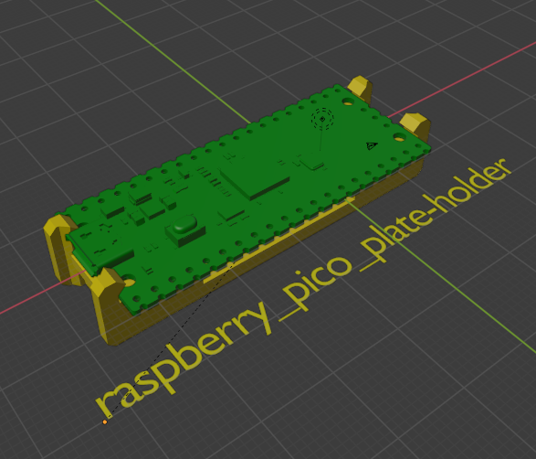

# MakerGrid Blender and STL Files for Cases

Here you find assorted case designs you can plug onto the MakerGrid.

## License

3D MakerGrid by Weird Constructor is licensed under the
Creative Commons - Attribution - Share Alike license.
