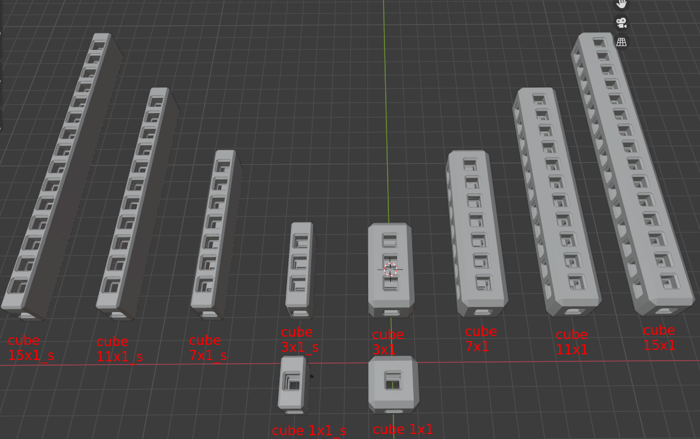
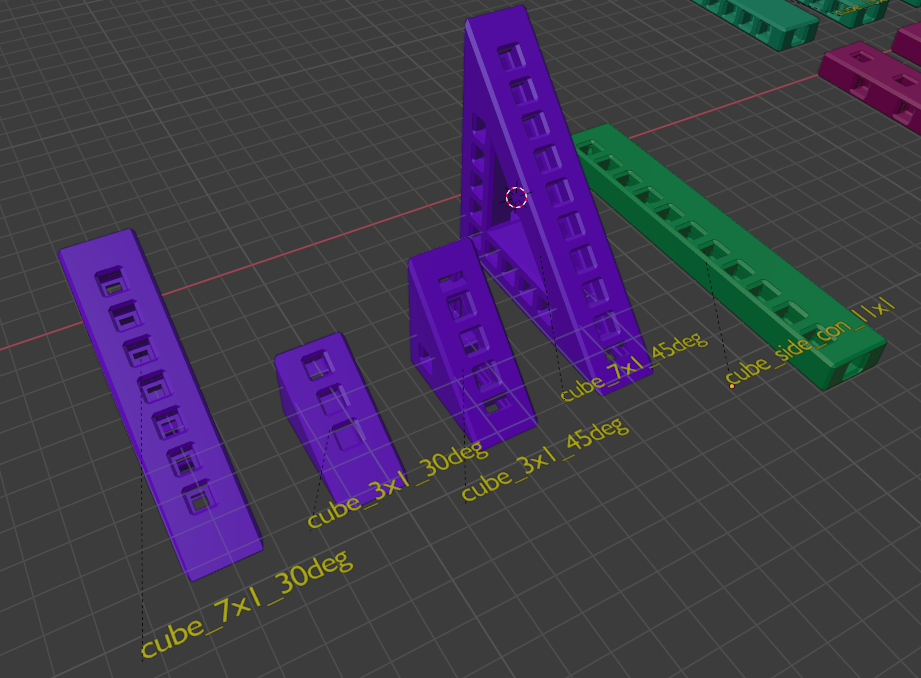
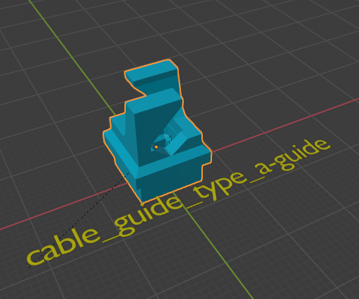
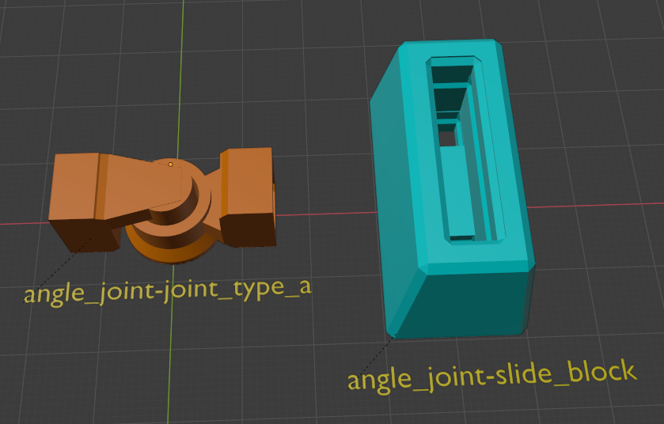
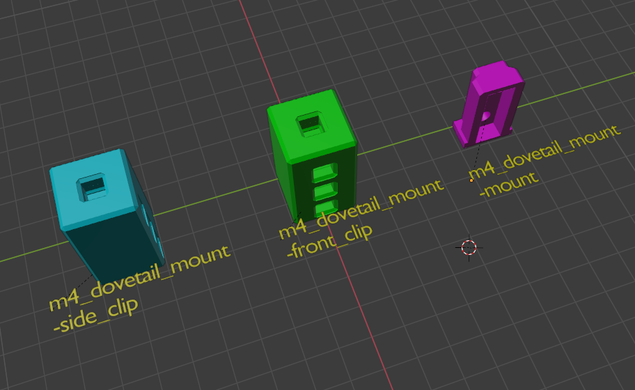
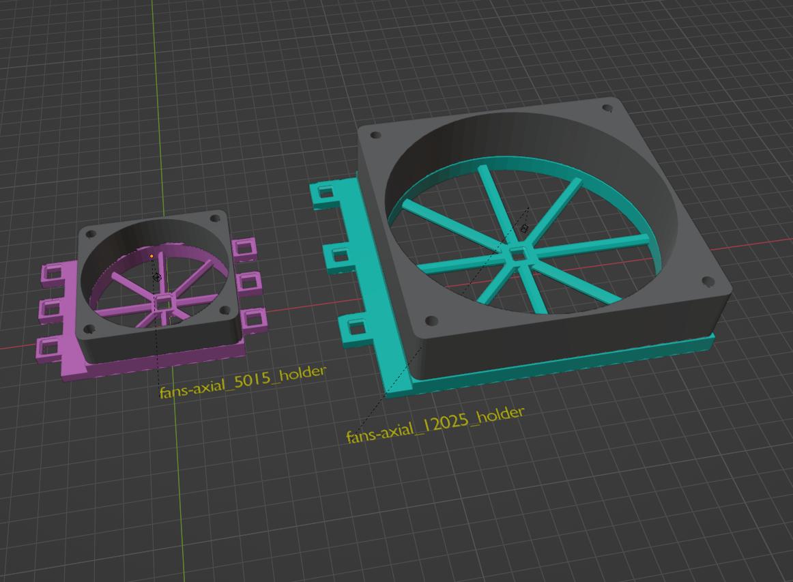
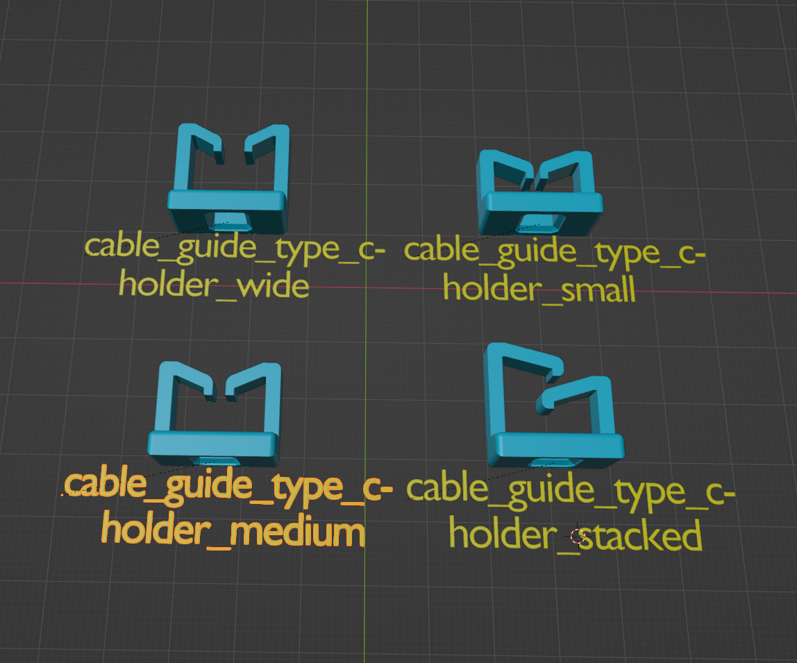
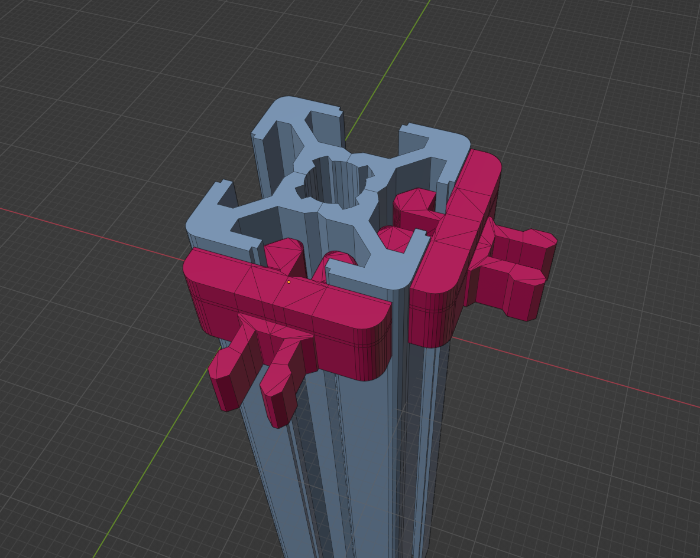

# Utilities for MakerGrid Blender and STL Files

A collection of assorted utilities for the MakerGrid:

# Aluminum Extrusion Utils

20x20 Aluminum Extrusion T-Slot clips (attention, these are under GPLv3):

- [t_slot_profile_util-t_slot_20x20_nut_6_mkg_clip_loose_fit.stl](t_slot_profile_util-t_slot_20x20_nut_6_mkg_clip_loose_fit.stl)
- [t_slot_profile_util-t_slot_20x20_nut_6_mkg_clip_tight_fit.stl](t_slot_profile_util-t_slot_20x20_nut_6_mkg_clip_tight_fit.stl)

The T-Slot side has been derived from: https://www.printables.com/model/54744-2020-cable-clips-t-slot-v-slot

    2020 cable clips (T-Slot & V-Slot) by Shaun Doe
    This work is licensed under a GNU General Public License v3.0
    which is Adapted from the (V-slot only) cable-clips
    of the Bear Upgrade as created by Grégoire Saunier. Created
    using the 2.1.0 source files.

## License

3D MakerGrid by Weird Constructor is licensed under the
Creative Commons - Attribution - Share Alike license.
