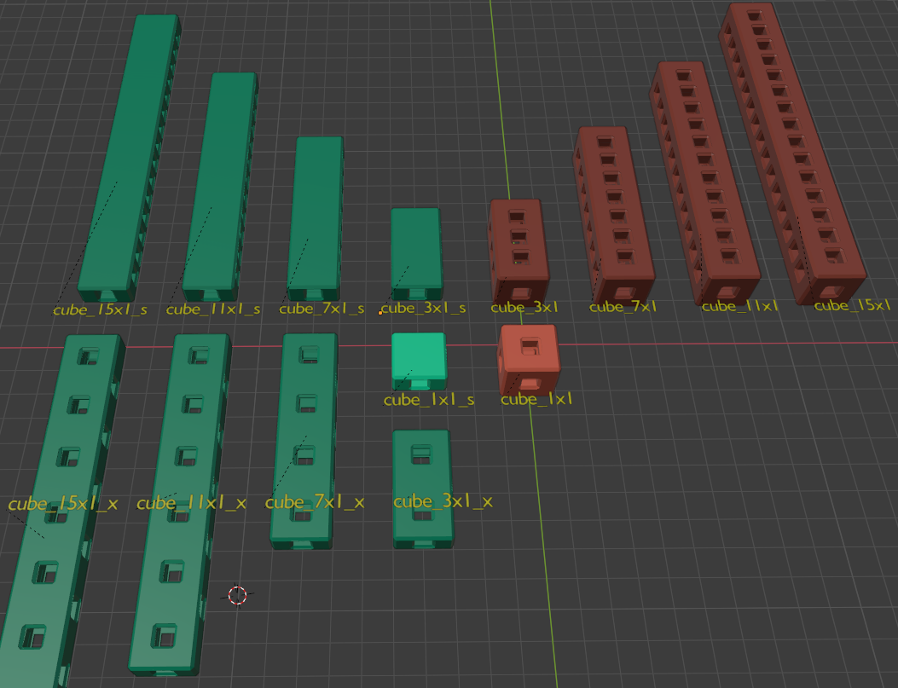

# Utilities for MakerGrid Blender and STL Files

A collection of assorted utilities for the MakerGrid:

## License

3D MakerGrid by Weird Constructor is licensed under the
Creative Commons - Attribution - Share Alike license.
